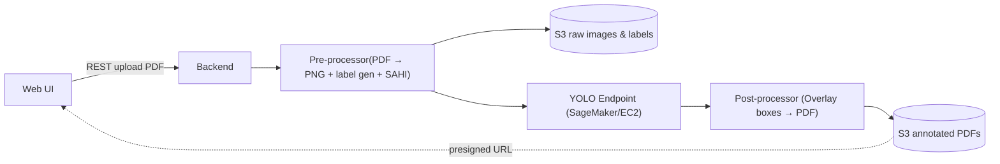

## 1 Overview  
Build a service that accepts a PDF of architectural drawings and returns the **same PDF annotated** with detected *floor-plans, elevations, sections*. Detection is done with YOLO + SAHI sliced inference; initial load ≈ 20 PDFs/day. The system must adapt to new drawing styles and support adding or removing object classes as requirements change. Success is **≥ 90 % recall** and **≥ 50 % faster quotations**.

---
## 2 Motivation  
Estimators spend hours skimming large drawing sets. Automating detection shortens turn-around, improves consistency, and frees engineers for higher-value work.

---
## 3 Success Metrics  

| Layer    | Metric                                    | Target                   |
| -------- | ----------------------------------------- | ------------------------ |
| Business | Avg quotation prep time                   | – 50 % faster then human |
| Model    | Recall @ 0.5 IoU                          | ≥ 90 %                   |
|          | mAP @ 0.5                                 | ≥ 0.75                   |
| System   | End-to-end latency (100-page, 0.5 GB PDF) | ≤ 2 hours                |

---
## 4 Requirements & Constraints  

### 4.1 Functional  
- Upload PDF → download annotated PDF.  
- Handle files ≤ 0.5 GB, ≤ 100 pages.  
- *(Optional later)*: CSV with per-class counts.

### 4.2 Non-functional  
- Throughput: 20 PDFs/day (burst × 3).  
- Availability ≥ 99 %.  
- Runs on AWS; no special security mandates.

## 5 Methodology  

### 5.1 Problem Statement  
Supervised **object detection** for three classes: floor-plan, elevation, section.

### 5.2 Data  
Original PDFs with embedded annotations. 

### 5.3 Techniques  
* **Pre-processing**: 
  1. Rasterize pages into PNG.  
  2. Extract annotation coordinates and convert them to YOLO-TXT (`x_center y_center width height class`).   
- **Slice** images with SAHI for small-object sensitivity.  
- **Detect** with YOLO.

### 5.4 Experimentation & Validation  
- k-fold cross-validation for recall/mAP.  
- Hold-out set for final evaluation.

### 5.5 Human-in-the-loop *(future)*  
- Web tool for quick label fixes to harvest false negatives.

---

## 6 Implementation  

### 6.1 High-level Design  

### 6.2 Infrastructure  

| Component        | AWS Service         | Notes                         |
|------------------|---------------------|-------------------------------|
| Storage          | S3                  | Versioned buckets             |
| Pre/Post compute | AWS Fargate         | Serverless CPU tasks          |
| Inference        | SageMaker Endpoint  | Auto-scales 1–4 GPU instances |
| Orchestration    | Step Functions      | State-machine for pipelines   |

### 6.3 Monitoring  
- Grafana/Loki/Prometheus metrics. 
- Experiment tracking.

### 6.4 Risks  
- Overfitting on small dataset → weekly active-learning refresh.  
- SAHI increases slice count → monitor cost vs. throughput.

---

## 7 Milestones  

| Week | Deliverable                           |
|------|---------------------------------------|
| 1    | Repo bootstrap, CI/CD setup           |
| 2    | Pre-/post-processing CLI demo         |
| 3    | First YOLO training, baseline metrics |
| 4    | Deploy pipeline, test on 5 PDFs       |
| 5    | User pilot, feedback collection       |

---

## 8 References  
- [PyMuPDF](https://pymupdf.readthedocs.io/)  
- [SAHI](https://github.com/obss/sahi)  
- [Ultralytics YOLOv8](https://github.com/ultralytics/ultralytics#yolov8)  
- [Amazon S3](https://docs.aws.amazon.com/s3/)  
- [Amazon SageMaker](https://docs.aws.amazon.com/sagemaker/)  
